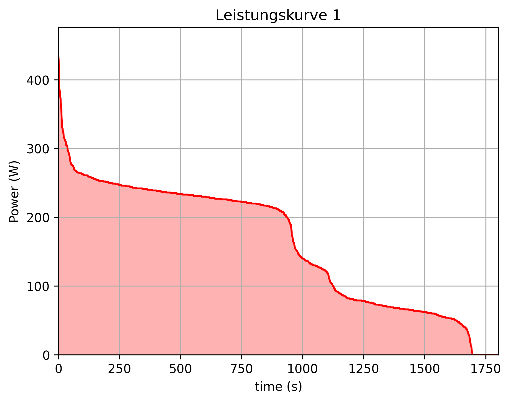

# Programmieruebung-2
Jakob Ladurner,
Janick Hoffmann

## Aufgabe 1
### wie installiere ich mit PDM?
-  1 Klone das Repository von Git
 - 1.1 gehe auf das repository, dann auf code und kopiere den code
 - 1.2 Öffne ein neues Fenster auf VS Studio
 - 1.3 Klicke auf repository klonen und füge den Link ein
- 2 aktiviere das virtual environment mit pdm install
 - 2.1 öffne das powershell Terminal in
 - 2.2 gib "pdm install" ein

Nun sollte das Repository geklont und das virtual environment aufgebaut sein

# How to use?
Möchtest du nun eine powercurve mit deinen Daten erzeugen, musst du deine Daten als CSV Datei mit richtiger Formatierung einfügen und im code load data den namen der zu ladenden Daten zu deiner Datei ändern. Dannach kannst du die Main datei ausführen. Wenn du die Übergabevariable "save" auf "True" stellst wird die Grafik als .png im Ordner figures gespeichert

### Abbildung
Hier ist die Abbildung, der ersten Aufgabe, die die Main datei erzeugt, sie dient als Beispielbild:

